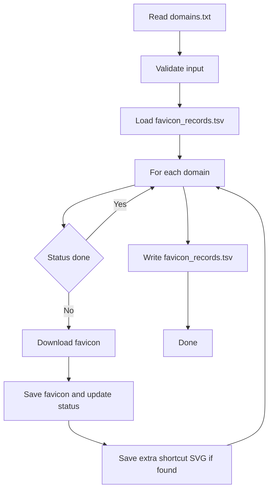

# favicons

## Commands

- `make download`
  - Downloads icons into `./favicon`
  - Uses `./favicon_records.tsv` as state
- `make png`
  - Generates PNG variants from `./favicon` into:
    - `./png/16`
    - `./png/32`
    - `./png/orig`
  - Requires `Pillow` (`pip install pillow`)
  - SVG conversion also needs `CairoSVG` (`pip install cairosvg`)
- `make prune`
  - Deletes files not listed in `domains.txt` from `./favicon` and `./png`

## Input (`domains.txt`)

- One domain per line
- Main domain: no indent
- Subdomain: indented under its main domain
- Main domains and subdomains must each be ABC-sorted

Example:

```text
google.com
  maps.google.com
naver.com
  terms.naver.com
```

## Record File (`favicon_records.tsv`)

TSV columns:

1. `domain`
2. `status` (`pending`, `ok`, `same_as_main`, `fail`)
3. `source_url`
4. `extra_svg_url` (optional)

If status is `ok` or `same_as_main`, that domain is skipped on the next run.

## Download Rules

1. Validate `domains.txt`
2. For each domain, skip if record status is done (`ok` / `same_as_main`)
3. Download using HTTPS only:
   - Try ICO candidates first:
     - shortcut icon links
     - `/favicon.ico`
     - other icon links
   - If `/favicon.ico` returns PNG bytes, save as `.png`
   - If ICO is not found, fallback to PNG/SVG candidates
4. Save to `./favicon/<domain>.<ext>` (no overwrite)
5. If subdomain icon bytes are same as main domain icon, mark `same_as_main`
6. If shortcut icon has SVG, save extra `.svg`
7. Update `favicon_records.tsv`

## Flow


